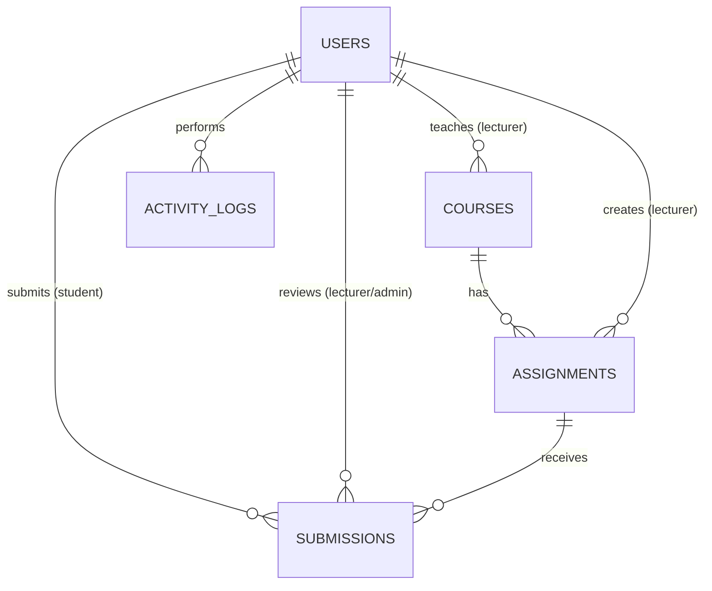

# EduSubmit — Database ERD

## Entity Relationship Diagram (Mermaid)

## Notes on the 3-role model

Original spec had a flat `Assignments` table (submission = assignment). With Lecturer added,
this is split into `Courses` → `Assignments` (defined by a Lecturer) → `Submissions` (uploaded
by a Student against an Assignment). This is a deviation from the original single-table spec —
flagging it here per project rules on major changes.

## Table: `users`

| Field | Type | Notes |
|---|---|---|
| id | UUID / bigint PK | |
| role | enum('student','lecturer','admin') | |
| full_name | varchar(150) | |
| matric_number | varchar(30), nullable, unique | students only |
| staff_id | varchar(30), nullable, unique | lecturers/admin only |
| email | varchar(255), unique | login identifier |
| password | varchar(255) | hashed (Django default) |
| department | varchar(100), nullable | |
| is_active | boolean, default true | for deactivation |
| created_at | timestamptz | |
| updated_at | timestamptz | |

## Table: `courses`

| Field | Type | Notes |
|---|---|---|
| id | PK | |
| course_code | varchar(20) | e.g. CSC301 |
| course_title | varchar(200) | |
| lecturer_id | FK → users.id | nullable until assigned |
| semester | varchar(20), nullable | e.g. "2025/2026 First" |
| created_at | timestamptz | |

## Table: `assignments`

| Field | Type | Notes |
|---|---|---|
| id | PK | |
| course_id | FK → courses.id | |
| lecturer_id | FK → users.id | denormalized for fast "my assignments" queries |
| title | varchar(200) | |
| description | text | |
| due_date | timestamptz, nullable | |
| max_score | integer, default 100 | |
| allowed_file_types | varchar(50), default "pdf,docx,doc,zip" | |
| max_file_size_mb | integer, default 15 | |
| created_at | timestamptz | |

## Table: `submissions`

| Field | Type | Notes |
|---|---|---|
| id | PK | |
| assignment_id | FK → assignments.id | |
| student_id | FK → users.id | |
| file_path | varchar(500) | |
| file_name | varchar(255) | original filename |
| file_size_kb | integer | |
| status | enum('submitted','under_review','reviewed','approved','rejected') | default 'submitted' |
| grade | integer, nullable | |
| feedback | text, nullable | |
| review_notes | text, nullable | internal, not shown to student |
| reviewed_by | FK → users.id, nullable | lecturer or admin |
| submitted_at | timestamptz | |
| reviewed_at | timestamptz, nullable | |

## Table: `activity_logs`

| Field | Type | Notes |
|---|---|---|
| id | PK | |
| user_id | FK → users.id, nullable | null = system action |
| action | varchar(100) | e.g. "submission.created", "review.approved" |
| metadata | jsonb, nullable | flexible context (e.g. submission_id, old/new status) |
| ip_address | inet, nullable | |
| timestamp | timestamptz | |

## Indexes (planned)

- `users(email)` unique
- `users(matric_number)` unique partial (where role='student')
- `submissions(student_id, status)` — dashboard queries
- `submissions(assignment_id)`
- `assignments(course_id)`
- `assignments(lecturer_id)`
- `activity_logs(user_id, timestamp DESC)`
